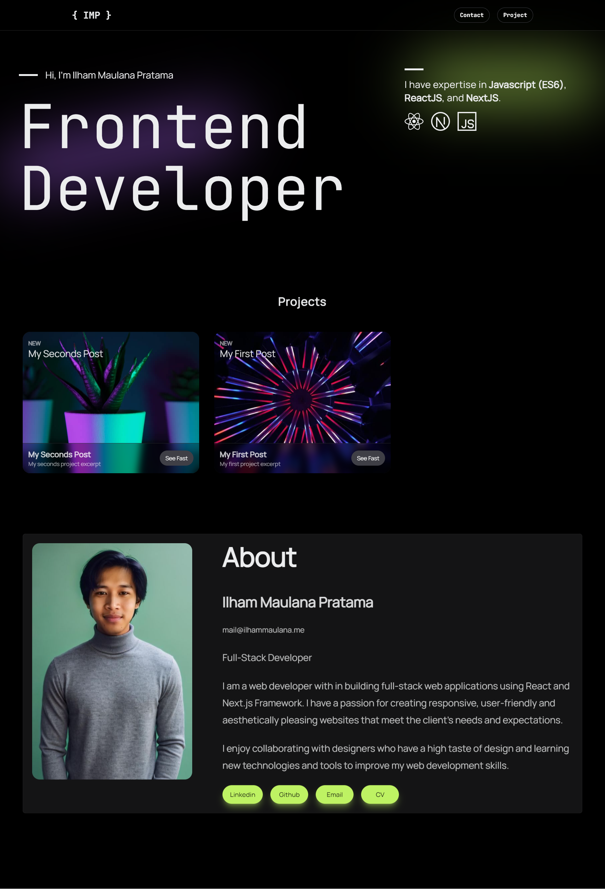

# My Portfolio Website

Portfolio site build with React Next.js 13 (App Router), combining Server and Client components, using ready build React UI Compunent with Next UI, styling with Tailwind CSS,  Animation with Framer Motion, Write project with Markdown using Contentlayer as content SDK.

Stack:

- [Next.js 13](https://nextjs.org) (App Router). Combining Server and Client components
- [Next UI](https://nextui.org). Beautiful, fast and modern React UI library.
- [Contentlayer](https://contentlayer.dev). Content SDK that validates and transforms your content into type-safe JSON data you can easily import into your application.
- [Tailwind CSS](https://tailwindcss.com). CSS framework
- [Framer Motion](https://www.framer.com). Animation library with a production-ready motion library for React.

Feel free to use this bootstrap Next.js Portfolio site. Also follow me on [Linkedin](linkedin.com/in/ilhammp).

